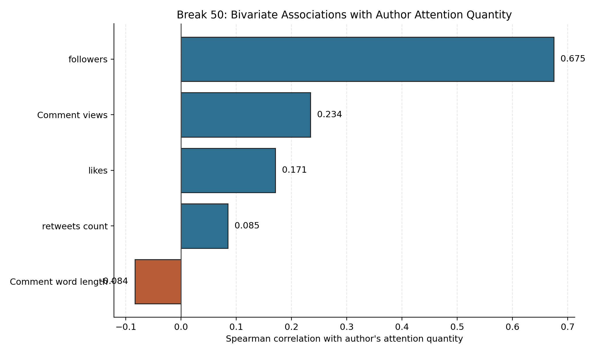
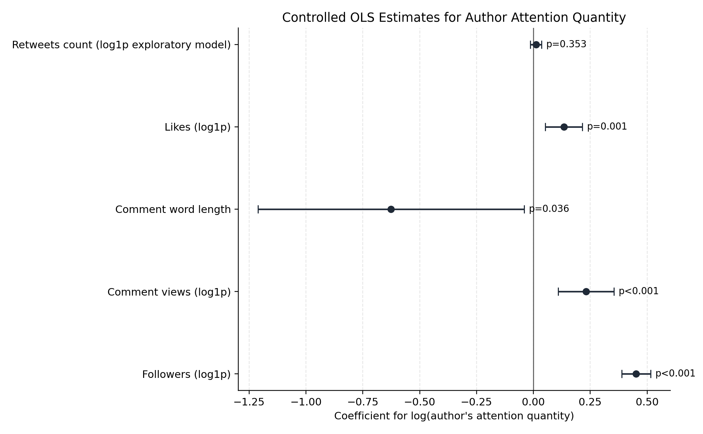
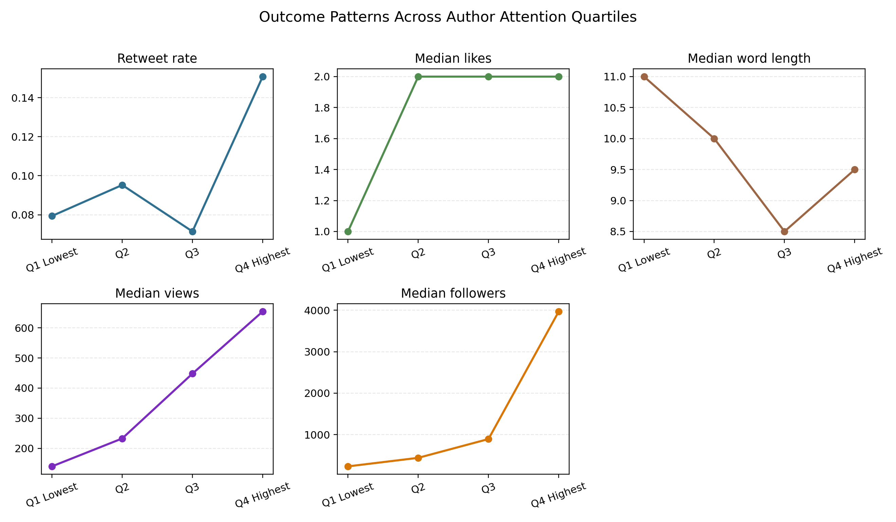

# Break 50 Final Report

## Title

**Author Attention Quantity and Comment-Level Outcomes in the Break 50 X Discussion**

## Abstract

This report examines whether **author's attention quantity** is associated with five comment-level outcomes in the Break 50 X/Twitter discussion dataset: `retweets count`, `likes`, `Comment word length`, `Comment views`, and `followers`. Using a dataset of **1,008 public comments** collected between **July 23, 2024** and **August 1, 2024**, the analysis combines descriptive statistics, bivariate correlations, quartile comparisons, and controlled regression models. The results show that author's attention quantity is most strongly related to `followers`, and is also positively associated with `Comment views` and `likes`. By contrast, its relationship with `retweets count` is weak and statistically unstable, while its relationship with `Comment word length` is modestly negative. Overall, the findings suggest that author's attention quantity is more closely linked to visibility and audience reach than to longer textual expression or redistribution through retweets.

## 1. Introduction

Digital platform discussions do not distribute visibility equally. Some users receive more exposure, endorsement, and reach than others, even when they participate in the same event-centered conversation. In the Break 50 discussion on X/Twitter, this raises an important question: does an author's own attention profile help explain how their comments perform?

This project focuses on **author's attention quantity** as the main independent variable and asks whether it is related to several indicators of comment performance and author position. The dependent variables are:

- `retweets count`
- `likes`
- `Comment word length`
- `Comment views`
- `followers`

Together, these variables capture different dimensions of social media engagement. Retweets indicate redistribution, likes indicate endorsement, comment views indicate visibility, word length reflects textual expression, and followers represent a broader audience position associated with the commenting author.

The broader significance of this question is theoretical as well as practical. Theoretically, it contributes to discussions of platform attention, digital influence, and stratified visibility. Practically, it helps explain how public conversation around a sports-media project like Break 50 may become shaped by structural author-level advantages rather than by comment content alone.

## 2. Research Question

The central research question is:

**How is author's attention quantity related to comment-level outcomes in the Break 50 dataset, specifically retweets count, likes, comment word length, comment views, and followers?**

Based on the project plan, the expectation is that higher author's attention quantity should be associated more strongly with visibility-oriented outcomes such as views, likes, and followers than with textual characteristics such as comment length.

## 3. Data

The analysis uses only one local dataset: `B50_X_COMMENT.xlsx`. In accordance with course policy, the raw Excel file is kept outside the public repository.

### Sample Characteristics

- Total comments: **1,008**
- Unique usernames: **740**
- Unique comment IDs: **845**
- Source posts: **4**
- Date range: **2024-07-23 02:02:13** to **2024-08-01 02:43:46**
- English-language comments: **920** (`91.3%`)
- Verified accounts: **833**
- Comments with zero retweets: **908** (`90.1%`)

These features matter for interpretation. The sample is highly skewed, especially for `retweets count`, `likes`, `Comment views`, and `followers`. The large share of zero-retweet comments means redistribution is relatively rare in this dataset, which makes retweets harder to model reliably with simple linear methods.

## 4. Variable Definitions

### Independent Variable

- `Author's attention quantity`
  - Treated as the focal predictor.
  - Used both in raw form for descriptive work and in `log(1 + x)` form for regression models because of strong right-skew.

### Dependent Variables

- `retweets count`
  - Proxy for comment redistribution.
- `likes`
  - Proxy for endorsement or appreciation.
- `Comment word length`
  - Proxy for how short or elaborate a comment is.
- `Comment views`
  - Proxy for exposure and visibility.
- `followers`
  - Proxy for the commenting author's broader audience reach.

### Control Variables

To reduce confounding, the controlled models include:

- `blue_verified`
- English-language indicator
- `number of media outlets`
- `number of author posts`

The two count-like controls are log-transformed before modeling.

## 5. Method

The analysis proceeds in four steps.

### Step 1. Descriptive Statistics

Summary statistics were calculated to understand variable distributions, medians, and extreme values.

### Step 2. Bivariate Correlations

Pearson and Spearman correlations were estimated between author's attention quantity and each dependent variable. Spearman correlations are especially useful here because the data are skewed and not well represented by normal assumptions.

### Step 3. Controlled Regression Models

Separate OLS models were estimated for:

- `log(1 + retweets count)` as an exploratory approximation
- `log(1 + likes)`
- `Comment word length`
- `log(1 + Comment views)`
- `log(1 + followers)`

Each model includes `log(1 + author's attention quantity)` as the key predictor, along with the control variables listed above. Robust standard errors were used in the implementation.

### Step 4. Quartile Comparison

To improve interpretability, the sample was split into four quartiles based on author's attention quantity. Outcome patterns were then compared across these quartiles.

## 6. Results

## 6.1 Descriptive Patterns

The descriptive statistics show strong skew across nearly all of the main engagement variables.

- Median `retweets count` is **0**
- Median `likes` is **1**
- Median `Comment word length` is **10**
- Median `Comment views` is **290**
- Median `followers` is **756**
- Median `Author's attention quantity` is **605**

This confirms that a small number of high-visibility observations account for a large share of the distribution, especially for views and followers.

## 6.2 Bivariate Associations

The rank-order correlations show that author's attention quantity is not equally related to all outcomes.

| Dependent variable | Spearman rho | Pearson r |
| --- | --- | --- |
| retweets count | 0.085 | 0.037 |
| likes | 0.171 | 0.083 |
| Comment word length | -0.084 | 0.080 |
| Comment views | 0.234 | 0.082 |
| followers | 0.675 | 0.177 |

Two findings stand out. First, the strongest relationship by far is with `followers` (`rho = 0.675`). Second, `Comment views` and `likes` are positively related to author's attention quantity, but much less strongly. `Comment word length` is weakly negative, suggesting that higher attention quantity does not correspond to longer comments.

## 6.3 Controlled Model Results

The controlled models provide a clearer picture of the independent association between author's attention quantity and each outcome after adjusting for verification status, language, media outlets, and total author posts.

| Outcome | Coefficient for log(attention) | Robust SE | 95% CI | p-value | R^2 |
| --- | --- | --- | --- | --- | --- |
| Retweets count (log1p exploratory model) | 0.012 | 0.013 | [-0.013, 0.036] | 0.353 | 0.025 |
| Likes (log1p) | 0.134 | 0.042 | [0.053, 0.215] | 0.001 | 0.082 |
| Comment word length | -0.626 | 0.299 | [-1.211, -0.040] | 0.036 | 0.096 |
| Comment views (log1p) | 0.231 | 0.063 | [0.109, 0.354] | <0.001 | 0.115 |
| Followers (log1p) | 0.452 | 0.032 | [0.388, 0.515] | <0.001 | 0.601 |

These results suggest five substantive conclusions:

1. `Followers` is the outcome most strongly associated with author's attention quantity.
2. `Comment views` also increase as author's attention quantity increases, even after controls.
3. `Likes` show a positive and statistically significant relationship with attention quantity.
4. `Comment word length` is modestly negative, suggesting that higher-attention authors are not writing longer comments.
5. `Retweets count` does not show a reliable association in this specification.

The coefficient plot below visualizes these estimates and confidence intervals.

## 6.4 Quartile Comparison

The quartile comparison helps translate the model results into a more intuitive descriptive pattern.

| Attention quartile | Median attention | Retweet rate | Median likes | Median word length | Median views | Median followers |
| --- | --- | --- | --- | --- | --- | --- |
| Q1 Lowest | 160.5 | 0.079 | 1.0 | 11.0 | 140.5 | 235 |
| Q2 | 425.0 | 0.095 | 2.0 | 10.0 | 233.0 | 441 |
| Q3 | 897.0 | 0.071 | 2.0 | 8.5 | 448.0 | 894 |
| Q4 Highest | 3771.5 | 0.151 | 2.0 | 9.5 | 654.0 | 3969 |

The most striking pattern is that the highest-attention quartile has much larger median values for `Comment views` and `followers` than the lower quartiles. The retweet pattern is more erratic, which is consistent with the weaker and nonsignificant regression result.

## 7. Discussion

The findings support the main claim of the project plan: **author's attention quantity is more closely tied to visibility and reach than to textual elaboration or sharing behavior**.

This pattern is theoretically meaningful. It suggests that author-level attention may function less as a driver of richer textual participation and more as a structural signal of platform prominence. Authors with higher attention quantity appear to be embedded in positions that generate greater audience exposure and broader audience scale. In that sense, the results align with platform research arguing that visibility online is stratified and cumulative rather than evenly distributed.

The weak retweet result is also important. It indicates that not every engagement metric responds in the same way to author attention quantity. Likes and views may be easier to accumulate under attention advantages, while retweeting may depend more heavily on other factors such as comment substance, political salience, identity cues, or network clustering.

The negative association with comment word length also adds nuance. Greater attention quantity does not imply that authors write more elaborate responses. If anything, higher-attention authors may be able to attract visibility without producing longer comments.

## 8. Limitations

Several limitations should be acknowledged.

- The dataset covers only one Break 50 conversation window and only one platform.
- The study is observational and cannot support causal claims.
- `followers` is conceptually different from the other dependent variables because it reflects author-level audience position rather than a direct response to a single comment.
- `retweets count` is highly zero-inflated, so the current log-transformed OLS treatment is only an approximation.
- Some unmeasured features, such as the semantic content of the comment, tone, political references, or network placement, may influence the observed outcomes.

## 9. Conclusion

This project shows that author's attention quantity is meaningfully associated with several important outcomes in the Break 50 X discussion. The strongest link is with `followers`, followed by `Comment views` and `likes`. By contrast, retweets are not reliably predicted in the current model, and comment length is slightly lower among higher-attention authors.

Taken together, the evidence suggests that author's attention quantity is best understood as a marker of **platform visibility and audience reach** rather than of longer expression or stronger redistribution. For the Break 50 project, this means that comment performance is shaped not only by what is said, but also by the broader attention position of the person saying it.

## 10. Repository Notes

This report is designed for a public GitHub repository submission. The repository includes:

- the project plan
- the analysis code
- generated figures
- markdown summary tables
- this report

The raw dataset is intentionally excluded from version control to comply with the course requirement.
